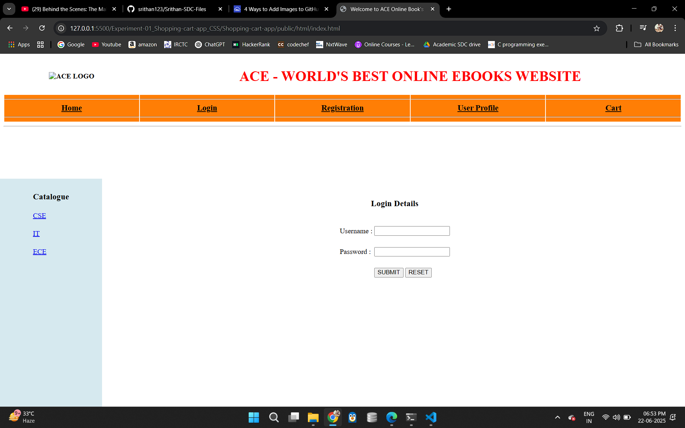
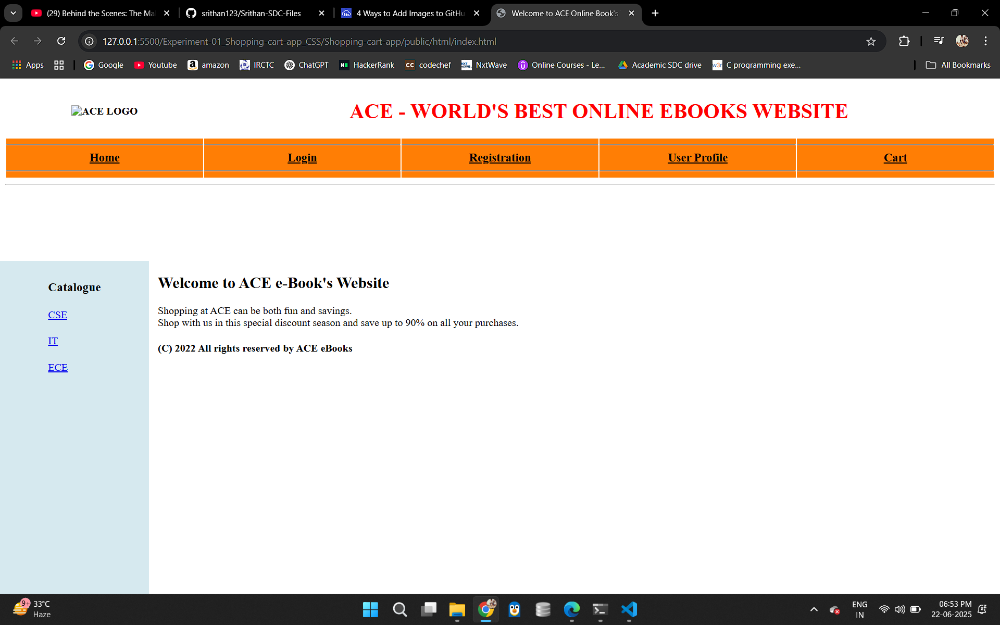
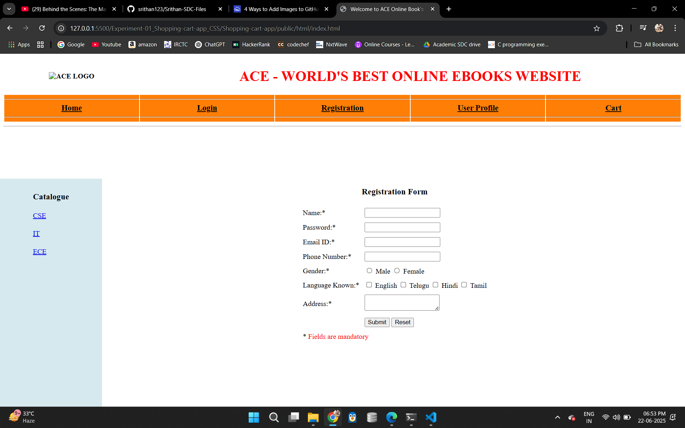

# 🛒 Experiment 1: Responsive Shopping Cart Web App

## Objective
Build a shopping cart system with registration, login, catalog, and cart pages using HTML, CSS (Flexbox & Grid), and JavaScript.

## Technologies Used
- HTML5
- CSS3 (Flexbox, Grid)
- JavaScript (DOM)

## Features
- Static registration/login forms
- Product catalog
- Add to cart functionality
- Responsive design

## Steps to Execute
1. Open `index.html` in any modern browser.
2. Browse the catalog, register/login (static), and add items to the cart.
3. Check the cart items dynamically updated via JavaScript.

## Folder Contents
- `index.html`: Main layout
- `style.css`: Flexbox/Grid-based styles
- `script.js`: Add-to-cart logic


Experiment 1: Shopping Cart Application (CSS3, Flex, Grid)
Folder Name (from image): Experiment-01_Shopping-cart-app_CSS

Description (from document): "Build a responsive web application for shopping cart with registration, login, catalog and cart pages using CSS3 features, flex and grid."

README.md for Experiment 1:

Markdown




# Experiment 1: Responsive Shopping Cart Application (CSS3, Flexbox, Grid)

This project focuses on building the foundational frontend of a responsive web application for an e-commerce shopping cart. The application includes essential pages like Registration, Login, Product Catalog, and Shopping Cart. The primary objective is to demonstrate proficiency in modern CSS3 features, particularly **Flexbox** and **CSS Grid**, to achieve a responsive and adaptable layout across various screen sizes.

## Features

* **Registration Page**: Allows new users to sign up.
* **Login Page**: Enables existing users to log in.
* **Product Catalog Page**: Displays a list of products, showcasing item details.
* **Shopping Cart Page**: Manages items added to the cart, displaying quantities and totals.
* **Responsive Design**: The layout dynamically adjusts for optimal viewing on desktops, tablets, and mobile devices.
* **Modern CSS3 Layouts**:
    * Utilizes **CSS Flexbox** for one-dimensional alignment and distribution of items (e.g., navigation bars, form elements, product cards within a row).
    * Utilizes **CSS Grid** for two-dimensional layout structures (e.g., overall page layout, complex catalog grids).
* **Semantic HTML5**: Uses appropriate HTML5 elements for better structure and accessibility.

## Technologies Used

* HTML5
* CSS3 (with strong emphasis on Flexbox and Grid)

## Setup and Running

1.  **Clone the Repository (or download the project files):**
    ```bash
    git clone [https://github.com/your-username/Experiment-01_Shopping-cart-app_CSS.git](https://github.com/your-username/Experiment-01_Shopping-cart-app_CSS.git)
    cd Experiment-01_Shopping-cart-app_CSS
    ```
2.  **Open in Browser:**
    * Navigate to the project directory.
    * Open `index.html` (or `registration.html`, `login.html`, `catalog.html`, `cart.html` directly) in your preferred web browser.
    * **No server is required** as this is a purely frontend (HTML/CSS) application.

## Project Structure

.
├── css/
│   └── style.css           # Main stylesheet with Flexbox and Grid rules
├── images/                 # Optional: directory for product images, logos etc.
├── registration.html       # Registration page
├── login.html              # Login page
├── catalog.html            # Product catalog page
├── cart.html               # Shopping cart page
└── README.md


## How to View Responsiveness

* Open any of the HTML pages in your browser.
* Resize your browser window horizontally.
* Alternatively, use your browser's developer tools (F12 or Cmd+Option+I) and enable "Responsive Design Mode" (or "Device Toolbar") to simulate different screen sizes and devices.

## Contributing

Feel free to fork this repository, open issues, or submit pull requests if you have suggestions for improvements or bug fixes.


## License

This project is open-source and available under the [MIT License](LICENSE-optional-if-you-add-one).
Experiment 2: Shopping Cart Application (Bootstrap)
Folder Name (from image): Experiment-02_Shopping-cart-app_Boot... (assuming it's Experiment-02_Shopping-cart-app_Bootstrap)

Description (from document): "Make the above web application responsive web application using Bootstrap framework."
