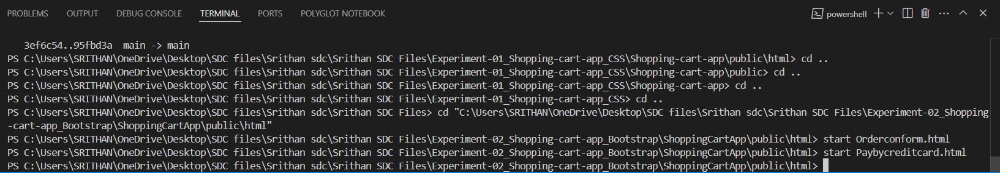
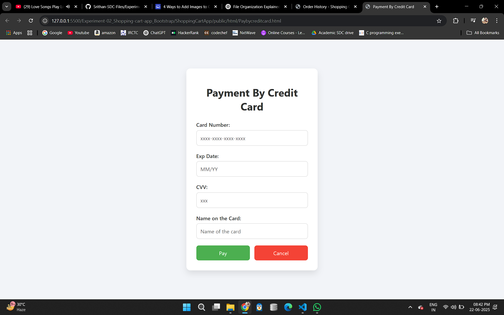
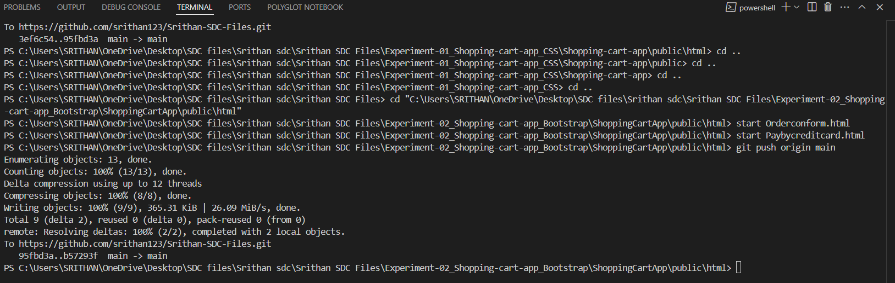

# 🎨 Experiment 2: Shopping Cart with Bootstrap

## Objective
Enhance the UI of the shopping cart using Bootstrap for responsiveness.

## Technologies Used
- HTML
- Bootstrap 5


## Features
- Responsive grid and cards
- Navbar and styled buttons

## Steps to Execute
1. Open `index.html` in your browser.
2. Resize the window to see responsive layout.

## Folder Contents
- `index.html`: Bootstrap grid layout
- Bootstrap CDN included
- `style.css`: Additional custom styles


Experiment 2: Shopping Cart Application (Bootstrap)
Folder Name (from image): Experiment-02_Shopping-cart-app_Boot... (assuming it's Experiment-02_Shopping-cart-app_Bootstrap)

Description (from document): "Make the above web application responsive web application using Bootstrap framework."

README.md for Experiment 2:

Markdown

# Experiment 2: Responsive Shopping Cart Application (Bootstrap Framework)

This project builds upon the foundation of Experiment 1 by re-implementing the responsive web application for an e-commerce shopping cart, this time utilizing the **Bootstrap framework**. The goal is to demonstrate how Bootstrap's pre-built components and responsive grid system can significantly accelerate and simplify the development of mobile-first, responsive web interfaces for pages like Registration, Login, Product Catalog, and Shopping Cart.

## Features

* **Registration Page**: Styled with Bootstrap forms and layout.
* **Login Page**: Implemented using Bootstrap's form and grid components.
* **Product Catalog Page**: Displays products using Bootstrap cards and grid for responsive arrangement.
* **Shopping Cart Page**: Utilizes Bootstrap tables and utilities for displaying cart items.
* **Full Responsiveness**: Leverages Bootstrap's highly optimized grid system and utility classes to ensure a seamless experience across all device sizes (mobile, tablet, desktop).
* **Bootstrap Components**: Demonstrates usage of various Bootstrap components such as:
    * Navigation Bars
    * Forms and Form Controls
    * Buttons
    * Cards
    * Tables
    * Alerts (optional)
    * Responsive Utilities

## Technologies Used

* HTML5
* CSS3
* Bootstrap 5 (or relevant version)
* JavaScript (for basic Bootstrap component functionality, e.g., navbar toggler)

## Setup and Running






1.  **Clone the Repository (or download the project files):**
    ```bash
    git clone [https://github.com/your-username/Experiment-02_Shopping-cart-app_Bootstrap.git](https://github.com/your-username/Experiment-02_Shopping-cart-app_Bootstrap.git)
    cd Experiment-02_Shopping-cart-app_Bootstrap
    ```
2.  **Ensure Bootstrap Inclusion:**
    * Verify that the `index.html` (and other HTML pages) correctly link to Bootstrap's CSS and JavaScript files (either via CDN or local files).
        * **CDN (Recommended for quick setup):**
            ```html
            <link href="[https://cdn.jsdelivr.net/npm/bootstrap@5.3.0/dist/css/bootstrap.min.css](https://cdn.jsdelivr.net/npm/bootstrap@5.3.0/dist/css/bootstrap.min.css)" rel="stylesheet">
            <script src="[https://cdn.jsdelivr.net/npm/bootstrap@5.3.0/dist/js/bootstrap.bundle.min.js](https://cdn.jsdelivr.net/npm/bootstrap@5.3.0/dist/js/bootstrap.bundle.min.js)"></script>
            ```
3.  **Open in Browser:**
    * Navigate to the project directory.
    * Open `index.html` (or `registration.html`, `login.html`, `catalog.html`, `cart.html` directly) in your preferred web browser.
    * **No server is required** as this is a purely frontend application.

## Project Structure

.
├── css/
│   └── custom.css          # Optional: For minor overrides or additional styles
├── js/                     # Optional: For custom JavaScript or Bootstrap's JS if not using CDN
├── images/                 # Optional: directory for product images, logos etc.
├── registration.html       # Registration page (Bootstrap styled)
├── login.html              # Login page (Bootstrap styled)
├── catalog.html            # Product catalog page (Bootstrap styled)
├── cart.html               # Shopping cart page (Bootstrap styled)
└── README.md