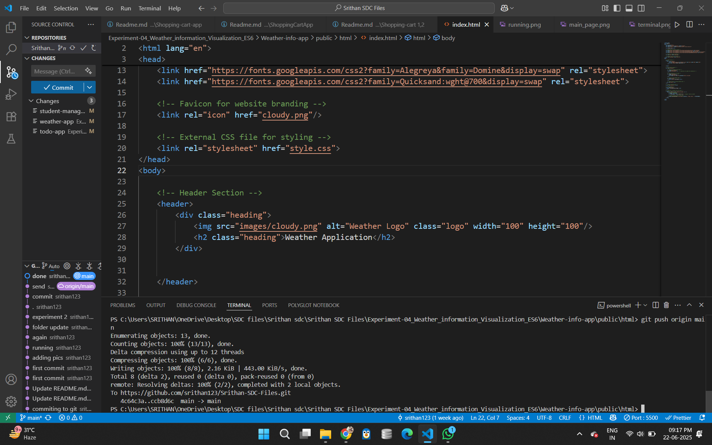
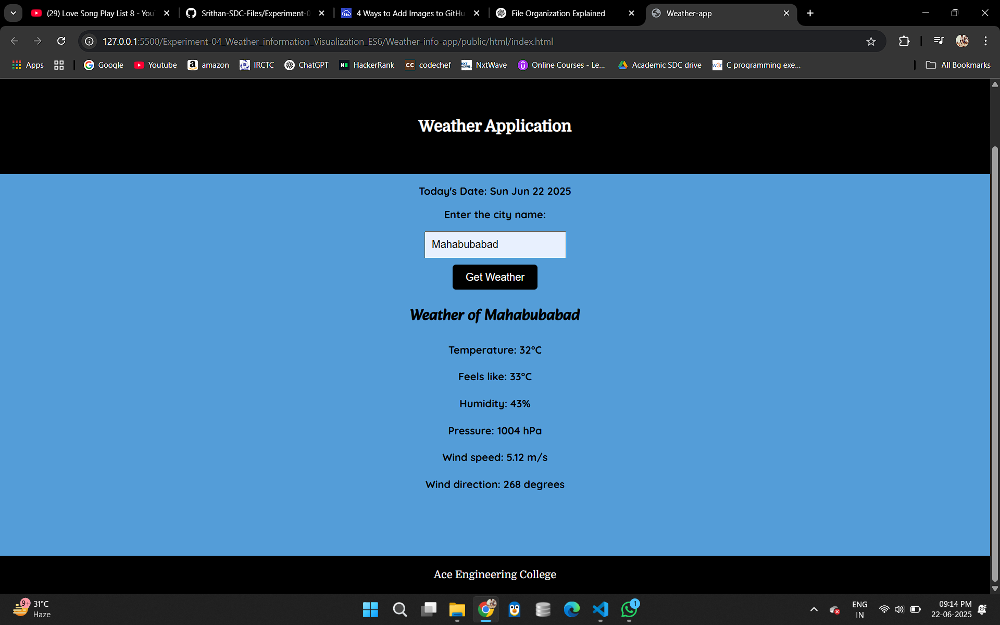

# 🌦️ Experiment 4: Weather App using ES6 and Fetch

## Objective
Create a weather app using modern JavaScript features to fetch live data from OpenWeatherMap.

## Technologies Used
- HTML, CSS
- JavaScript (ES6+)
- OpenWeatherMap API
- Chart.js

## Features
- Real-time weather info
- Weather graph using Chart.js
- Async/Await, Promises

## Steps to Execute
1. Get your API key from https://openweathermap.org/api.
2. Insert API key in `weather.js`.
3. Open `index.html` in browser.




## Folder Contents
- `index.html`: UI layout
- `weather.js`: Fetch & render data
- `style.css`: Basic styling


Experiment 4: Weather Information Visualization (ES6, OpenWeatherMap API)
Folder Name (from image): Experiment-04_Weather_information_Vis... (assuming it's Experiment-04_Weather_information_Visualization)

Description (from document): "Explore the features of ES6 like arrow functions, callbacks, promises, async/await. Implement an application for reading the weather information from openweathermap.org and display the information in the form of a graph on the web page."

README.md for Experiment 4:

Markdown

# Experiment 4: Weather Information Visualization (ES6, OpenWeatherMap API, Charting)

This project demonstrates the implementation of a web application that fetches weather information from the `openweathermap.org` API and visualizes it using a charting library. A key focus of this experiment is the utilization of modern **ECMAScript 6 (ES6)** features such as **arrow functions, callbacks, Promises, and `async/await`** for efficient and readable asynchronous operations.

## Features

* **Weather Data Fetching**: Retrieves current or forecasted weather data from the OpenWeatherMap API.
* **ES6 Asynchronous Programming**:
    * **Arrow Functions**: Used for concise function definitions, especially in callbacks.
    * **Callbacks**: Basic pattern for handling asynchronous responses.
    * **Promises**: Manages asynchronous operations, providing a cleaner way to handle success/failure.
    * **`async/await`**: Provides a synchronous-like syntax for handling Promises, making asynchronous code more readable and easier to manage.
* **Data Visualization**: Displays key weather metrics (e.g., temperature over time, humidity) in a graphical format using a JavaScript charting library (e.g., Chart.js, D3.js, or a simpler custom graph).
* **User Input**: Allows users to input a city name to fetch weather data.
* **Error Handling**: Gracefully handles API errors or network issues.

## Technologies Used

* HTML5
* CSS3
* JavaScript (ES6+)
* **OpenWeatherMap API**: For weather data.
* **Charting Library**: (e.g., Chart.js)

## Prerequisites

1.  **OpenWeatherMap API Key**: You need to obtain a free API key from [OpenWeatherMap.org](https://openweathermap.org/api).
    * Sign up/Login.
    * Go to "My API keys" section to generate a key.
2.  **Internet Connection**: Required to fetch data from the OpenWeatherMap API.

## Setup and Running

1.  **Clone the Repository (or download the project files):**
    ```bash
    git clone [https://github.com/your-username/Experiment-04_Weather_information_Visualization.git](https://github.com/your-username/Experiment-04_Weather_information_Visualization.git)
    cd Experiment-04_Weather_information_Visualization
    ```
2.  **Configure API Key:**
    * Open `js/main.js` (or similar JavaScript file where API calls are made).
    * Locate the placeholder for the OpenWeatherMap API key and replace it with your actual key:
        ```javascript
        const API_KEY = 'YOUR_OPENWEATHERMAP_API_KEY'; // <--- REPLACE THIS
        ```
3.  **Ensure Charting Library Inclusion:**
    * Verify that `index.html` correctly links to the chosen charting library's JavaScript file (e.g., Chart.js CDN).
        ```html
        <script src="[https://cdn.jsdelivr.net/npm/chart.js](https://cdn.jsdelivr.net/npm/chart.js)"></script>
        ```
4.  **Open in Browser:**
    * Navigate to the project directory.
    * Open `index.html` in your preferred web browser.
    * **No server is strictly required for local file access, but sometimes API calls from `file://` URLs can be blocked by browser security policies (CORS). If you encounter issues, consider serving the files via a simple local HTTP server (e.g., Python's `http.server` or Node.js `http-server`).**

## Project Structure

.
├── css/
│   └── style.css               # Styles for the UI
├── js/
│   └── main.js                 # Core JavaScript logic (API calls, ES6 features, chart rendering)
├── index.html                  # Main application page
└── README.md