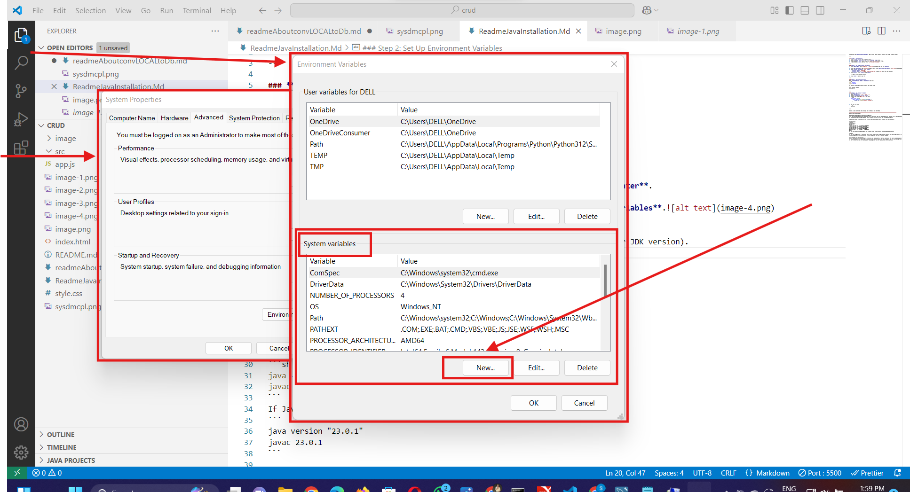

# Experiment 5: Java Standalone CRUD Application (JDBC with Oracle/MySQL)

This project develops a standalone Java application that demonstrates fundamental **CRUD (Create, Read, Update, Delete) operations** on a database table. The application connects to either an **Oracle or MySQL database** using **JDBC (Java Database Connectivity)**, illustrating the core principles of database interaction from a Java console application.

## Features

* **Database Connectivity**: Establishes a connection to a relational database (configured for either Oracle or MySQL).
* **CRUD Operations**:
    * **Create**: Inserts new records into a `STUDENTS` table.
    * **Read**: Retrieves and displays all records from the `STUDENTS` table, or specific records based on criteria.
    * **Update**: Modifies existing records in the `STUDENTS` table.
    * **Delete**: Removes records from the `STUDENTS` table.
* **Prepared Statements**: Utilizes `PreparedStatement` to prevent SQL injection vulnerabilities and improve performance for repetitive queries.
* **Resource Management**: Ensures proper closing of JDBC resources (`Connection`, `Statement`, `PreparedStatement`, `ResultSet`) using `try-with-resources` (or `finally` blocks for older Java versions) to prevent resource leaks.
* **Error Handling**: Includes robust error handling for `SQLException` and other potential issues during database operations.
* **Configurable Database**: Easy to switch between Oracle and MySQL by modifying connection details.

## Technologies Used

* Java SE
* JDBC API
* Oracle Database OR MySQL Database
* Oracle JDBC Driver (`ojdbcX.jar`) OR MySQL Connector/J (`mysql-connector-java-X.X.X.jar`)

## Prerequisites and Database Setup

Before running this project, ensure you have the following:

1.  **Java Development Kit (JDK)**: Installed on your system.
2.  **Database Instance**: A running Oracle Database instance OR MySQL Database instance.
3.  **JDBC Driver**:
    * For **Oracle**: Download `ojdbcX.jar` (e.g., `ojdbc11.jar`) from Oracle's website.
    * For **MySQL**: Download `mysql-connector-java-X.X.X.jar` from MySQL's website.
    * Place the chosen driver JAR file in a `lib/` folder within your project or add it directly to your project's build path.
4.  **Database User and Table**:
    * You need a database user with appropriate privileges (`SELECT`, `INSERT`, `UPDATE`, `DELETE`, `CREATE TABLE`).
    * Create the `STUDENTS` table in your chosen database using the following SQL DDL:

    ```sql
    -- For Oracle
    CREATE TABLE STUDENTS (
        ID NUMBER(10) PRIMARY KEY,
        NAME VARCHAR2(100) NOT NULL,
        AGE NUMBER(3),
        MAJOR VARCHAR2(100)
    );

    -- For MySQL
    CREATE TABLE STUDENTS (
        ID INT PRIMARY KEY,
        NAME VARCHAR(100) NOT NULL,
        AGE INT,
        MAJOR VARCHAR(100)
    );
    ```

    * **Important**: Update the `DB_URL`, `DB_USER`, `DB_PASSWORD`, and `DB_DRIVER_CLASS` constants in `JdbcCrudDemo.java` to match your specific database type and connection details.

## Setup and Running

1.  **Clone the Repository (or create manually):**
    ```bash
    git clone [https://github.com/your-username/Experiment-05_Java-standalone_CRUD_App.git](https://github.com/your-username/Experiment-05_Java-standalone_CRUD_App.git)
    cd Experiment-05_Java-standalone_CRUD_App
    ```

2.  **Add JDBC Driver to Project:**
    * Create a `lib/` directory in your project root if it doesn't exist.
    * Place the chosen `ojdbcX.jar` (for Oracle) or `mysql-connector-java-X.X.X.jar` (for MySQL) into the `lib/` folder.
    * **In your IDE (IntelliJ IDEA/Eclipse):** Add this JAR file to your project's build path (or classpath).
        * **IntelliJ IDEA:** Right-click on `ojdbcX.jar` / `mysql-connector-java-X.X.X.jar` -> `Add as Library...`.
        * **Eclipse:** Right-click on Project -> `Properties` -> `Java Build Path` -> `Libraries` tab -> `Add JARs...` (or `Add External JARs...`).

3.  **Update Database Configuration:**
    * Open `src/main/java/com/example/jdbc/JdbcCrudDemo.java`.
    * **Uncomment and update** the appropriate `DB_URL`, `DB_USER`, `DB_PASSWORD`, and `DB_DRIVER_CLASS` variables for your chosen database (Oracle or MySQL). Make sure the other database's configuration is commented out.

4.  **Run the Application:**
    * Open your IDE.
    * Navigate to `src/main/java/com/example/jdbc/JdbcCrudDemo.java`.
    * Right-click on `JdbcCrudDemo.java` and select `Run 'JdbcCrudDemo.main()'`.

## Expected Output

The program will print messages to the console indicating:

* JDBC driver registration.
* Connection success or failure.
* Results of each INSERT, SELECT, UPDATE, and DELETE operation (e.g., "X rows inserted/updated/deleted", "Students Table: ...").
* Any SQL errors encountered.

## Verification

After running the Java program, you can connect to your database using a client tool (e.g., SQL Developer for Oracle, MySQL Workbench/CLI for MySQL) and run:

```sql
SELECT * FROM STUDENTS;
Experiment-05_Java-standalone_CRUD_MySQL/image-4.png
