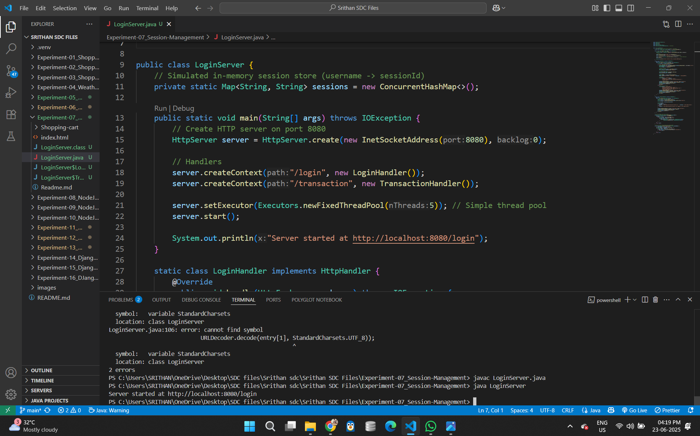
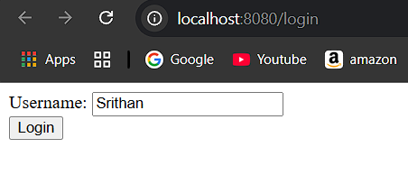
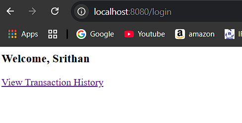
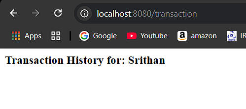

PROGRAM 7 – Session Management in Shopping Cart Web Application

AIM
To implement session tracking in a shopping cart web application using HTTP Sessions in Java Servlets.

DESCRIPTION
This experiment demonstrates how to maintain user-specific data (such as a shopping cart) using HTTP sessions in Java Servlets. When a user adds products to the cart, the servlet tracks the session and stores cart data in memory without requiring a database write for every interaction. This implementation improves performance and user experience by keeping state between page requests.
The solution uses Java Servlets for backend processing, HTML/CSS for frontend interface, and the built-in session management API provided by the servlet framework.

PROJECT STRUCTURE
shopping-cart-session/
│
├── src/
│   └── servlets/
│       ├── ProductServlet.java         # Lists products
│       └── CartServlet.java            # Handles add-to-cart with session
│
├── WebContent/
│   ├── index.html                      # Welcome page
│   ├── catalog.html                    # Displays product list with add buttons
│   ├── cart.html                       # Displays cart contents from session
│   └── WEB-INF/
│       ├── web.xml                     # Servlet and session config
│       └── lib/
│           └── mysql-connector-j-9.3.0.jar
│
├── bin/                                # Compiled .class files
├── lib/
│   └── javax.servlet-api-4.0.1.jar
├── README.md                           # Project documentation

  
INSTALLATION & SETUP
PREREQUISTIES
•	Java JDK
•	Apache Tomcat
•	MySQL
•	VS Code with Java Extensions
•	Servlet API (javax.servlet-api-4.0.1.jar)

STEPS TO RUN THE PROJECT
1.	Add Required JARs to lib/:
o	mysql-connector-j-9.3.0.jar
o	javax.servlet-api-4.0.1.jar
2.	Compile Servlets:
javac -cp "lib/*" -d bin src/servlets/ProductServlet.java src/servlets/CartServlet.java

3.	Deploy to Tomcat:
o	Copy WebContent/ into tomcat/webapps/shopping-cart-session/
o	Copy compiled bin/ classes to WEB-INF/classes/
4.	Start Tomcat Server
5.	Visit in Browser:
6.	http://localhost:8080/shopping-cart-session/index.html

DATABASE SETUP
Database: shopping_cart
Table: products
CREATE TABLE products (
  id INT PRIMARY KEY AUTO_INCREMENT,
  name VARCHAR(100),
  price DECIMAL(10,2)
);

# 🔐 Experiment 7: Session and Cookie Tracking

## Objective
Track users across sessions and pages using Cookies and HTTP Session.

## Technologies Used
- Java Servlet
- HTTP Session API

## Features
- Session creation
- User tracking

## Steps to Execute
1. Deploy servlet on Tomcat.
2. Use browser to log in and navigate.
3. Check session ID and user data.

## Folder Contents
- `LoginServlet.java`
- `SessionExample.java`
- `web.xml`

# Java Web Application: Session Tracking Mechanisms

This project demonstrates various session tracking mechanisms crucial for maintaining user state across stateless HTTP requests in a Java web application. It specifically showcases the use of HTTP Cookies and HTTP Session (server-side sessions).

## Features

* **Cookie-based Session Tracking:**
    * `SetCookieServlet`: Sets a simple cookie named 'lastVisit' with the current timestamp.
    * `ReadCookieServlet`: Reads and displays all cookies sent from the client to the server.
* **HTTP Session Management:**
    * `LoginServlet`: Authenticates a dummy user (`user`/`pass`). Upon successful login, it creates an HTTP Session and stores the logged-in username.
    * `DashboardServlet`: A protected page that verifies if a valid session exists and retrieves the username from it. If no session or user is found, it redirects to the login page.
    * `LogoutServlet`: Invalidates the current HTTP Session, effectively logging the user out.

## Technologies Used

* Java SE
* Java Servlets
* JSP (JavaServer Pages) for views
* Apache Tomcat (or any Servlet Container)

## Setup and Running

1.  **Prerequisites:**
    * Java Development Kit (JDK) installed (e.g., JDK 11 or higher).
    * Apache Tomcat (version 9 or 10 recommended) installed and configured.
    * An IDE like IntelliJ IDEA Ultimate or Eclipse with WTP (Web Tools Platform) is highly recommended for easy deployment.

2.  **Project Setup (using an IDE like IntelliJ IDEA):**
    * Open IntelliJ IDEA.
    * Go to `File > New > Project...`.
    * Select `Jakarta EE` (or `Java Enterprise` for older versions of IDEA/Java).
    * Choose `Web Application` (or `Web Profile` template).
    * Select `Servlet` as a technology.
    * Select your installed JDK and configure your Tomcat server.
    * Name your project (e.g., `SessionTrackingDemo`).
    * Ensure that `web.xml` is generated in `src/main/webapp/WEB-INF/`.

3.  **Add Source Code:**
    * Place the Java servlet files (`SetCookieServlet.java`, `ReadCookieServlet.java`, `LoginServlet.java`, `DashboardServlet.java`, `LogoutServlet.java`) into your project's source folder, typically `src/main/java/com/example/sessions` (adjust package name as per your setup).
    * Place the JSP files (`index.jsp`, `dashboard.jsp`, `logout.jsp`) into the `src/main/webapp` directory.
    * Verify or update `web.xml` in `src/main/webapp/WEB-INF/` to correctly map your servlets if you're not using `@WebServlet` annotations or for additional configuration.

4.  **Configure Deployment (in IntelliJ IDEA):**
    * Go to `Run > Edit Configurations...`.
    * Select your Tomcat Server configuration.
    * Navigate to the `Deployment` tab.
    * Click the `+` icon and select `Artifact... > [YourProjectName]:war exploded`.
    * Set the `Application context` to `/SessionTrackingDemo` (or any path you prefer).
    * Click `Apply` then `OK`.

5.  **Run the Application:**
    * Start your Tomcat server from your IDE (usually by clicking the 'Run' or 'Debug' button associated with your Tomcat configuration).
    * Open your web browser and navigate to: `http://localhost:8080/SessionTrackingDemo/` (replace `SessionTrackingDemo` with your actual application context path).

## Usage

### Cookie Demonstration

1.  **Set a Cookie:** Visit `http://localhost:8080/SessionTrackingDemo/set-cookie`. A message will confirm the cookie "lastVisit" has been set.
2.  **Read Cookies:** Visit `http://localhost:8080/SessionTrackingDemo/read-cookie`. This page will display all cookies currently stored by your browser for this domain, including the "lastVisit" cookie if set.

### HTTP Session Demonstration (Login/Logout)

1.  **Access Login:** Go to `http://localhost:8080/SessionTrackingDemo/` (which loads `index.jsp`).
2.  **Login:** Enter `username: user` and `password: pass`. Click "Login".
    * Upon successful login, you will be redirected to the `dashboard.jsp` page, which indicates your session is active.
    * You can open a new browser tab/window and navigate directly to `http://localhost:8080/SessionTrackingDemo/dashboard`. You should still be logged in because the session is persistent for that browser.
3.  **Logout:** On the dashboard page, click "Logout".
    * You will be redirected back to the `index.jsp` page with a logout message.
    * If you now try to access `http://localhost:8080/SessionTrackingDemo/dashboard` again, you will be redirected back to the login page, as your session has been invalidated.

## Project Structure

.
├── src/main/java/com/example/sessions/
│   ├── SetCookieServlet.java   # Sets a 'lastVisit' cookie
│   ├── ReadCookieServlet.java  # Reads and displays cookies
│   ├── LoginServlet.java       # Handles user login and session creation
│   ├── DashboardServlet.java   # Checks session for access to dashboard
│   └── LogoutServlet.java      # Invalidates the session
├── src/main/webapp/
│   ├── WEB-INF/
│   │   └── web.xml             # Deployment descriptor
│   ├── index.jsp               # Login form and links to cookie demo
│   ├── dashboard.jsp           # Protected page displaying session info
│   └── logout.jsp              # Confirmation for logout
└── README.md