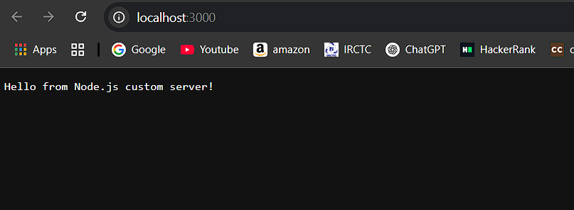

# ⚙️ Experiment 8: Custom Node.js Server

## Objective
Create a basic Node.js server using core modules.

## Technologies Used
- Node.js (HTTP module)

## Features
- Respond to GET and POST requests

## Steps to Execute
1. Run: `node server.js`
2. Open: http://localhost:3000




## Folder Contents
- `server.js`: Custom server logic


# Node.js Custom HTTP Server & Core Modules Exploration

This project demonstrates building a basic HTTP server using Node.js's built-in `http` module and explores other fundamental Node.js core modules such as `fs` (File System), `os` (Operating System), `path`, and `events`.

## Features

* **Custom HTTP Server:** Built from scratch using the `http` module, handling various routes.
* **Static File Serving:** Serves `index.html` and `about.html` from the `public` directory using the `fs` (File System) module.
* **Operating System Information:** An endpoint (`/os-info`) that provides detailed information about the server's operating system using the `os` module (e.g., hostname, platform, memory usage).
* **Path Manipulation:** An endpoint (`/path-demo`) illustrating functions from the `path` module for joining paths, parsing paths, and extracting file extensions.
* **Custom Event Handling:** Demonstrates the `events` module by creating a custom event emitter that logs server activity to the console and to a persistent log file (`logs/server_logs.txt`).

## Technologies Used

* Node.js
* Built-in Node.js modules: `http`, `fs`, `os`, `path`, `events`

## Setup and Running

1.  **Prerequisites:**
    * Node.js (LTS version recommended) installed on your system. You can download it from [nodejs.org](https://nodejs.org/).

2.  **Clone the repository (or create manually):**
    ```bash
    git clone <repository_url>
    cd nodejs-custom-server # or your project directory name
    ```
    If creating manually, create a directory and then create `server.js`, `public/index.html`, `public/about.html`, and `logs/` folder.

3.  **Install Dependencies:**
    This project uses only Node.js core modules, so `npm install` is not strictly necessary for dependencies, but it's good practice if you have a `package.json` (created via `npm init -y`).

4.  **Start the Server:**
    Open your terminal or command prompt, navigate to the project root directory, and run:
    ```bash
    node server.js
    ```
    You should see the message: `Server running on http://localhost:3000/`.

## Usage

Once the server is running, open your web browser and navigate to the following URLs:

* **`http://localhost:3000/`**: Access the main home page (`index.html`).
* **`http://localhost:3000/about`**: View the about page (`about.html`).
* **`http://localhost:3000/os-info`**: Get JSON formatted information about the server's operating system.
* **`http://localhost:3000/path-demo`**: See JSON formatted output demonstrating `path` module functionalities.

**Important:**

* **Console Output:** Observe the terminal where you started the server. You will see "LOG EVENT" messages indicating requests and server activity.
* **Log File:** A file named `server_logs.txt` will be created inside the `logs/` directory (if it doesn't exist) and will continuously record server events.

## Project Structure

.
├── server.js               # Main server logic and module demonstrations
├── public/                 # Directory for static HTML files
│   ├── index.html          # Home page
│   └── about.html          # About page
├── logs/                   # Directory for server log files
│   └── server_logs.txt     # Log file (created/appended by the server)
├── package.json            # Project metadata (if npm init was used)
└── README.md