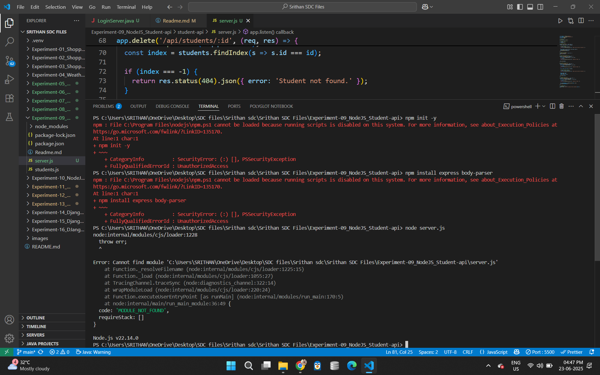

PROGRAM 9 – RESTful Student API with Node.js and Express

AIM
To implement a RESTful API for managing student data using Node.js and Express.

DESCRIPTION
This experiment demonstrates how to build a simple REST API using Node.js and Express. The API allows users to perform CRUD (Create, Read, Update, Delete) operations on student records. It simulates a backend service that could be extended with a database in a real-world scenario. Data is stored in-memory for simplicity. This lightweight implementation is ideal for learning API fundamentals, including route handling, JSON processing, and basic REST design. The solution uses Express.js for backend routing and Node.js for the runtime environment.

PROJECT STRUCTURE
student-api/
│
├── server.js # Main server file
├── package.json # Project metadata and dependencies
├── node_modules/ # Installed npm modules
└── README.md # Project documentation

 

INSTALLATION & SETUP
PREREQUISITES
•	Node.js
•	VS Code or any text editor

STEPS TO RUN THE PROJECT
1. Clone or Create Project Folder  
   mkdir student-api
   cd student-api

2.Initialize Node.js Project
npm init -y

3.Install Express
npm install express

4.Create server.js File
Write your API logic in server.js (CRUD for students).
5.Start the Server
node server.js

6.Visit in Browser
http://localhost:3000/api/students

API ENDPOINTS
Get All Students
GET /api/students
Add a Student
POST /api/students
Body:
{
  "name": "Swayam",
  "age": 21,
  "course": " Mathematics"
}

Update Student by ID
PUT /api/students/:id
Delete Student by ID
DELETE /api/students/:id

SAMPLE OUTPUT
[
  {
    "id": 1,
    "name": "Swayam",
    "age": 21,
    "course": "Mathematics"
  }
]

# 🔁 Experiment 9: Express CRUD API

## Objective
Create an Express server to perform CRUD on student data.

## Technologies Used
- Node.js
- Express
- Postman

## Features
- RESTful API (GET, POST, PUT, DELETE)

## Steps to Execute
1. Run: `npm install express`
2. Start server: `node server.js`
3. Test with Postman

## Folder Contents
- `server.js`: REST endpoints


# Express.js REST API for Student Data (CRUD)

This project implements a simple RESTful API using the Express.js framework for Node.js. It allows you to perform basic CRUD (Create, Read, Update, Delete) operations on a collection of student data. For simplicity, the data is stored in memory (an array of JavaScript objects) and is not persistent across server restarts.

## Features

* **RESTful Endpoints:**
    * `GET /api/students`: Retrieve a list of all students.
    * `GET /api/students/:id`: Retrieve a single student by their unique ID.
    * `POST /api/students`: Add a new student record.
    * `PUT /api/students/:id`: Update an existing student record by ID.
    * `DELETE /api/students/:id`: Delete a student record by ID.
* **JSON Support:** Handles JSON request bodies and sends JSON responses.
* **In-Memory Data:** Student data is stored in an array, suitable for demonstration purposes.

## Technologies Used

* Node.js
* Express.js (web application framework)
* Postman (or any API testing tool) for testing endpoints

## Setup and Running

1.  **Prerequisites:**
    * Node.js (LTS version recommended) and npm (Node Package Manager) installed on your system.
    * Postman (or similar API testing tool) installed for testing the API endpoints.

2.  **Clone the repository (or create manually):**
    ```bash
    git clone <repository_url>
    cd express-student-api # or your project directory name
    ```
    If creating manually, create a directory and then create `server.js` within it.

3.  **Initialize Project and Install Dependencies:**
    Open your terminal or command prompt, navigate to the project root directory, and run:
    ```bash
    npm init -y      # Initializes a package.json file
    npm install express # Installs the Express.js framework
    ```

4.  **Create `server.js`:**
    Create a file named `server.js` in the project root and paste the provided conceptual code.

5.  **Start the API Server:**
    In your terminal, run:
    ```bash
    node server.js
    ```
    You should see a message indicating that the Express API is running on `http://localhost:3000`.

## API Endpoints and Usage (with Postman)

The API server will be running on `http://localhost:3000`. Use Postman to send requests to the following endpoints:

### 1. Get All Students

* **Method:** `GET`
* **URL:** `http://localhost:3000/api/students`
* **Expected Response (200 OK):** An array of student objects.
    ```json
    [
        {"id": 1, "name": "Alice Smith", "age": 20, "major": "Computer Science"},
        {"id": 2, "name": "Bob Johnson", "age": 22, "major": "Electrical Engineering"}
    ]
    ```

### 2. Get Student by ID

* **Method:** `GET`
* **URL:** `http://localhost:3000/api/students/:id` (e.g., `http://localhost:3000/api/students/1`)
* **Expected Response (200 OK):** A single student object.
    ```json
    {"id": 1, "name": "Alice Smith", "age": 20, "major": "Computer Science"}
    ```
* **Error Response (404 Not Found):** If ID does not exist.
    ```json
    {"message": "Student not found"}
    ```

### 3. Create a New Student

* **Method:** `POST`
* **URL:** `http://localhost:3000/api/students`
* **Headers:** `Content-Type: application/json`
* **Body (raw JSON):**
    ```json
    {
        "name": "David Lee",
        "age": 23,
        "major": "Chemistry"
    }
    ```
* **Expected Response (201 Created):** The newly created student object including its assigned ID.
    ```json
    {"id": 4, "name": "David Lee", "age": 23, "major": "Chemistry"}
    ```
* **Error Response (400 Bad Request):** If required fields are missing.
    ```json
    {"message": "Name, age, and major are required."}
    ```

### 4. Update an Existing Student

* **Method:** `PUT`
* **URL:** `http://localhost:3000/api/students/:id` (e.g., `http://localhost:3000/api/students/1`)
* **Headers:** `Content-Type: application/json`
* **Body (raw JSON):**
    ```json
    {
        "name": "Alice Johnson Smith",
        "major": "Advanced Computer Science"
    }
    ```
* **Expected Response (200 OK):** The updated student object.
    ```json
    {"id": 1, "name": "Alice Johnson Smith", "age": 20, "major": "Advanced Computer Science"}
    ```
* **Error Response (404 Not Found):** If ID does not exist.
    ```json
    {"message": "Student not found"}
    ```

### 5. Delete a Student

* **Method:** `DELETE`
* **URL:** `http://localhost:3000/api/students/:id` (e.g., `http://localhost:3000/api/students/2`)
* **Expected Response (200 OK):** A success message.
    ```json
    {"message": "Student deleted successfully"}
    ```
* **Error Response (404 Not Found):** If ID does not exist.
    ```json
    {"message": "Student not found"}
    ```

## Project Structure

.
├── server.js               # Main Express application file with API routes
├── package.json            # Project metadata and dependencies
├── package-lock.json       # Records exact dependency versions
└── README.md