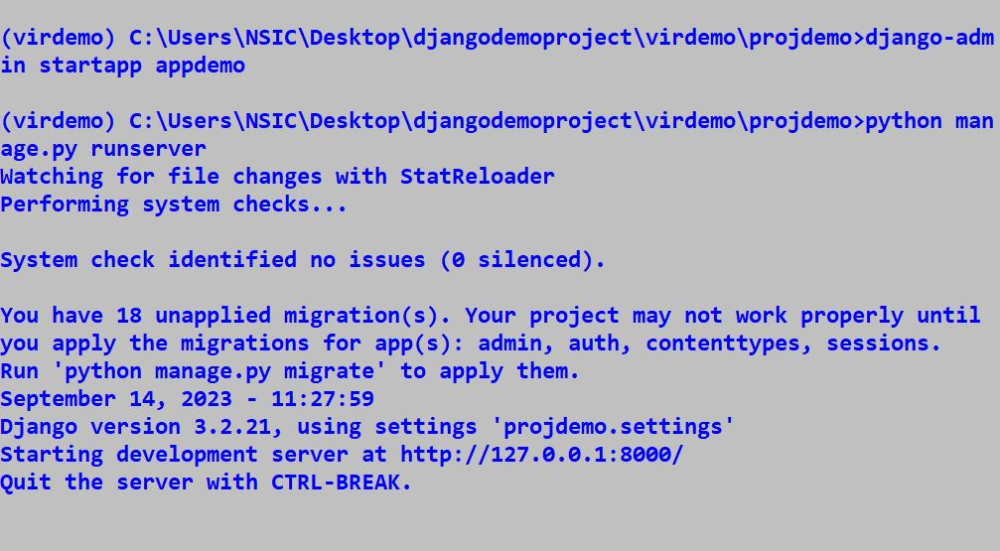

Program 14 - Django Student Management

AIM  
To develop a student management system backend using Django, allowing users to register, login, and access information through a clean and basic Canvas-style UI.

DESCRIPTION  
This experiment demonstrates how to build a basic web application using Django. The project implements user authentication (register and login), and basic navigation through pages like Home, About, and Contact. It showcases Django concepts like URL routing, views, templates, and static file management. This project is ideal for beginners to learn the fundamentals of Django web development including template rendering, view functions, and project structure.

PROJECT STRUCTURE  
student_mgmt/
├── core/
│ ├── views.py # Contains views for all pages
│ ├── urls.py # App URL routing
├── templates/
│ ├── base.html # Base template with common UI elements
│ ├── home.html # Home page template
│ ├── about.html # About page template
│ ├── contact.html # Contact page template
│ ├── login.html # Login page template
│ └── register.html # Registration page template
├── student_mgmt/
│ ├── settings.py # Project settings including installed apps and templates
│ ├── urls.py # Project-level URL routing
├── db.sqlite3 # SQLite database file
├── manage.py # Django project management script
└── README.md # Project documentation

     
INSTALLATION & SETUP 
PREREQUISITES  
•	Python 3.x  
•	Django 5.2  
•	VS Code or any preferred code editor  
•	Basic knowledge of Python and Django framework  

STEPS TO RUN THE PROJECT  
1.Clone the repository (or create the project and app as per instructions)  
git clone <repository-url>
cd student_mgmt

2.Create a virtual environment and activate it (optional but recommended)
python -m venv venv
source venv/bin/activate   # Linux/Mac
venv\Scripts\activate      # Windows

3.Install Django
pip install django==5.2

4.Run migrations
python manage.py migrate

5.Create a superuser (optional, for admin access)
python manage.py createsuperuser

6.Run the development server
python manage.py runserver

7.Open the app in your browser
Visit:
http://127.0.0.1:8000/

 
LICENSE
This project is licensed under the MIT License.
